# Configuratie pfSense

- Keymap: `be.iso.kbd: Belgian ISO-8859-1`
- Partitioning: `Auto (UFS)`
**Nu wordt pfSense geïnstalleerd**

Na het heropstarten:

"Enter the parent interface name for the new VLAN (or nothing if finished):"

`<Enter>`

We steken een kabel in, in `bge0`, zodat deze de WAN-interface wordt.

WAN: bge0
LAN: em0

We veranderen het IP-adres (niet default 192.168.1.1/24) door op 2 te drukken.

Zie IP-adressen schema.

Onderste poort is WAN, bovenste is LAN.

# Afbeeldingen + verloop

## Interfaces

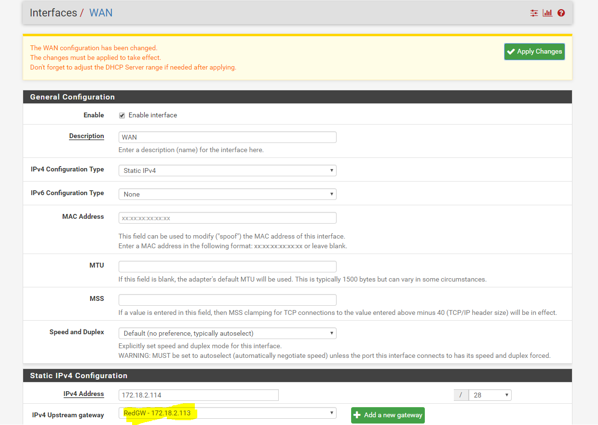

### Interfaces / WAN

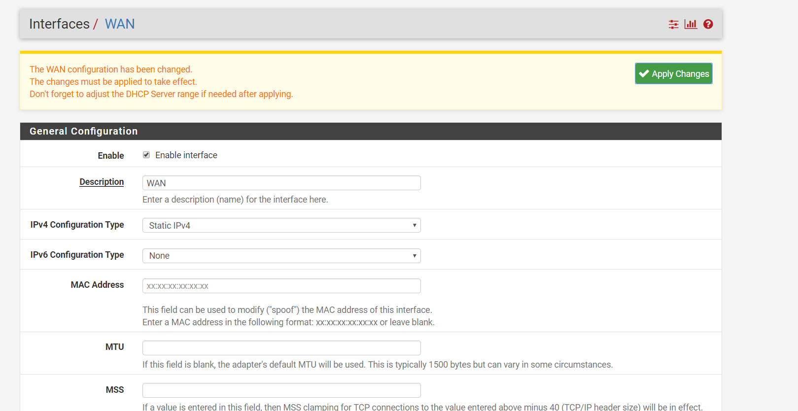

## System / Advanced / Admin Access

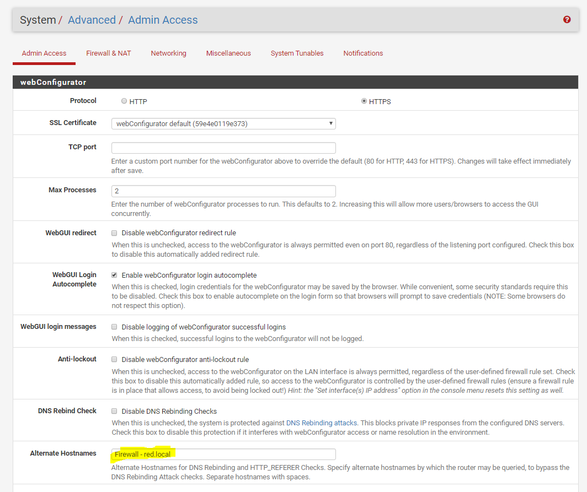
**Alternate hostname: zonder spaties!**
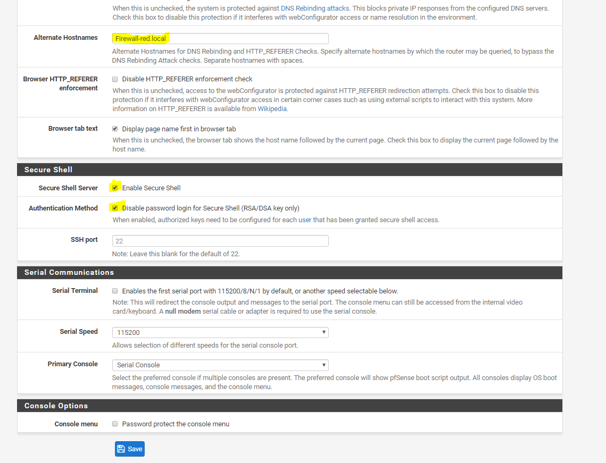
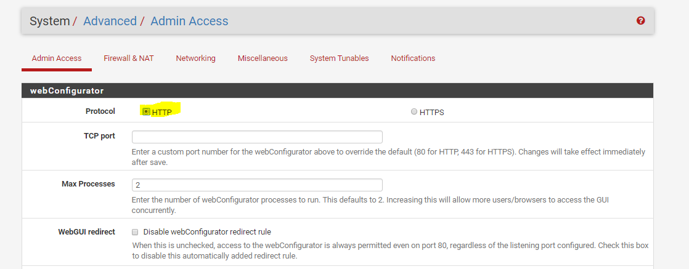

## System / General Setup

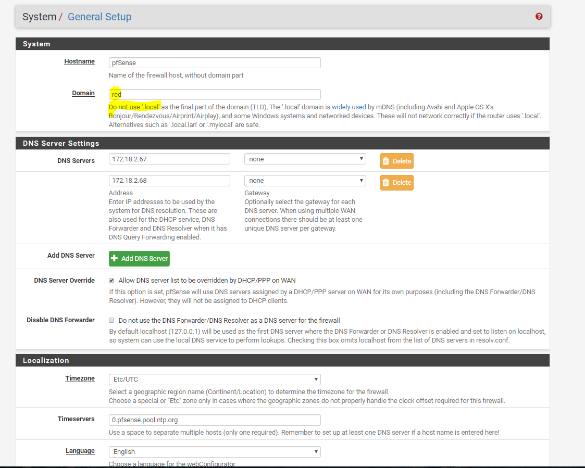
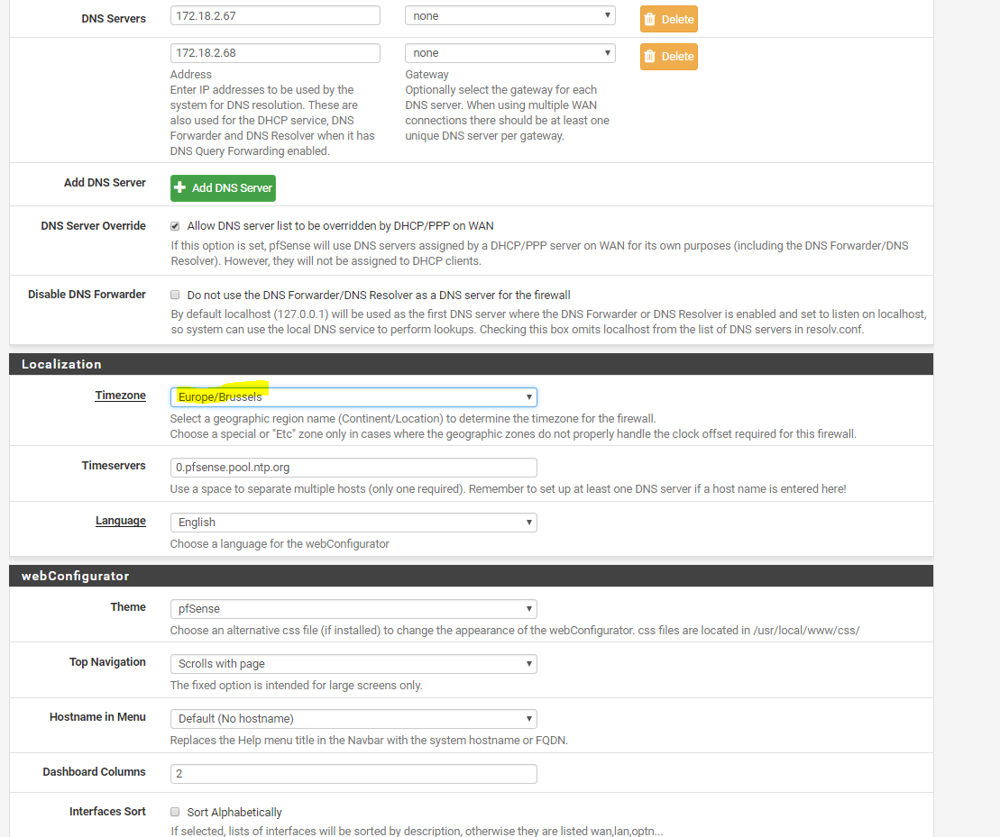
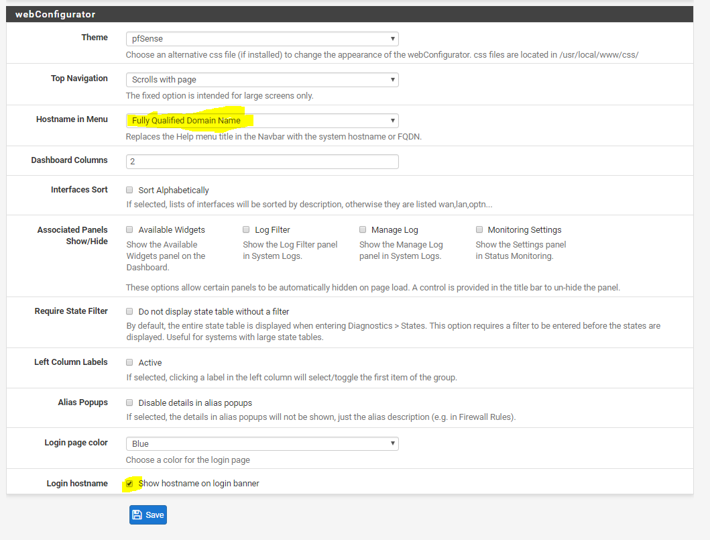

**Do not use the DNS Forwarder/DNS Resolver**

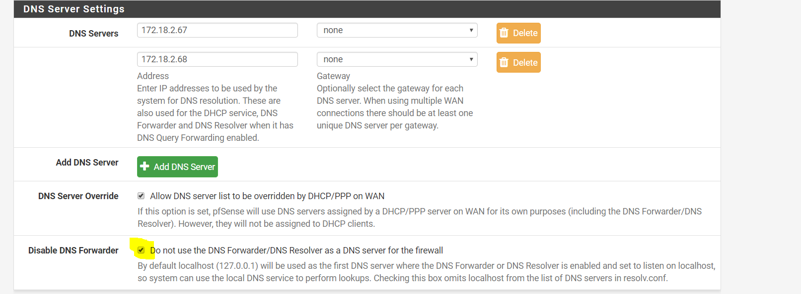

## System / Routing / Gateways

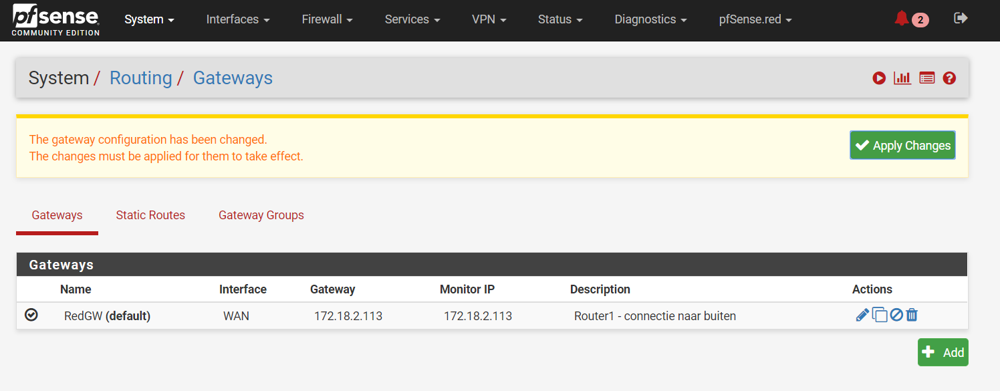

## Services / DNS Resolver / General Settings

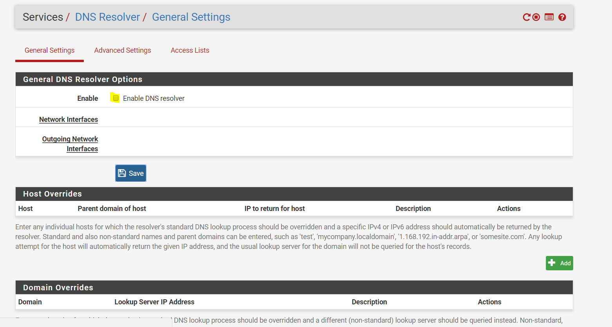
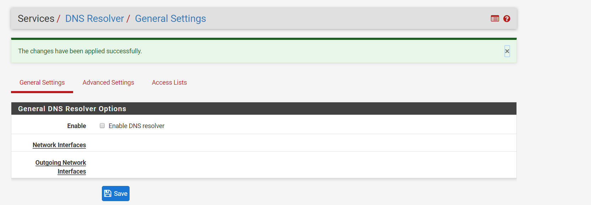

**Schakel DNS Forwarder bij "Services" ook uit!**

## Wizard

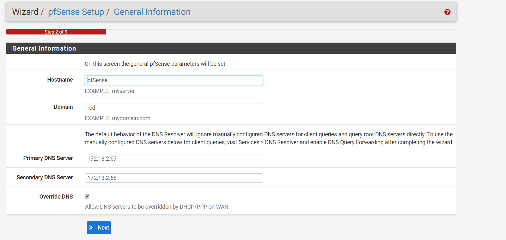
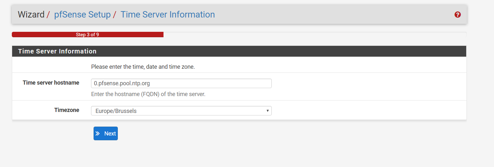
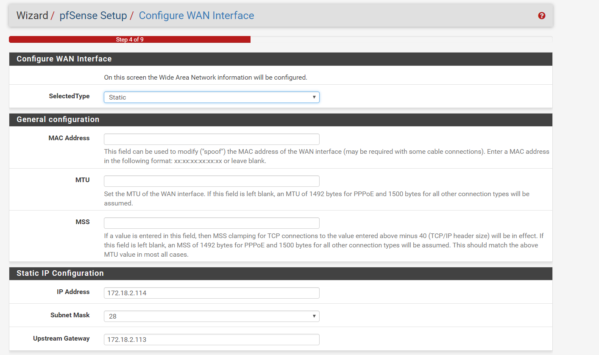
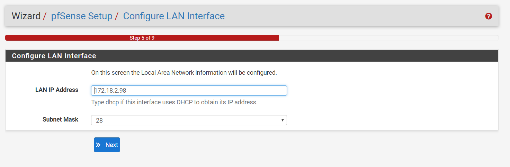