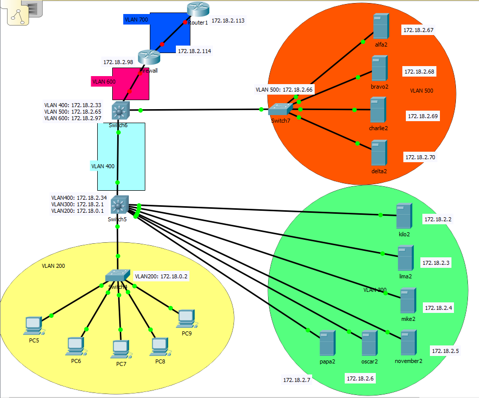

# Netwerk

## Packettracer

In deze map kan u al een Packettracer terugvinden (red.local) die de IP-adressering beschrijft van alle netwerkinterfaces die
gebruikt worden in onze opstelling. Momenteel is geen enkele switch/router/MLS al geconfigureerd. 

