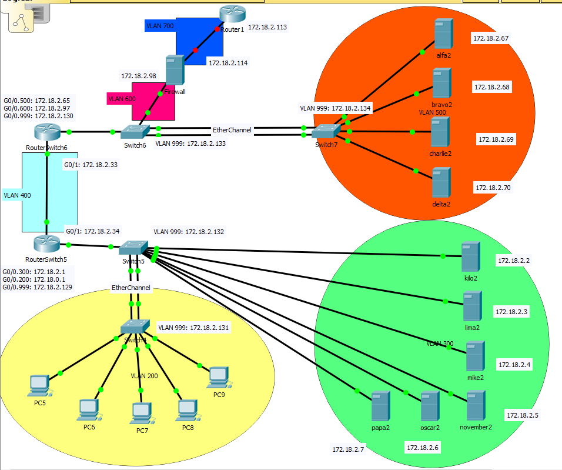

# Netwerk

## Packettracer

In deze map kan u al een Packettracer terugvinden (red.local) die de IP-adressering beschrijft van alle netwerkinterfaces die
gebruikt worden in onze opstelling. Momenteel is geen enkele switch/router/MLS al geconfigureerd.

In de PDF VLSM-red kan je terugvinden hoe alles is verdeeld.

In de map `configuraties` kan je de txt-bestanden terugvinden voor alle switches en routers die we zullen configureren + extra uitleg waarom die op die manier geconfigureerd is. 

