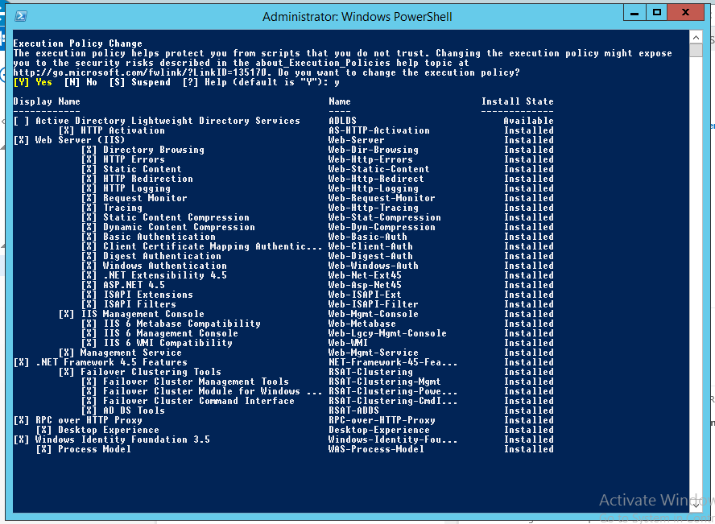
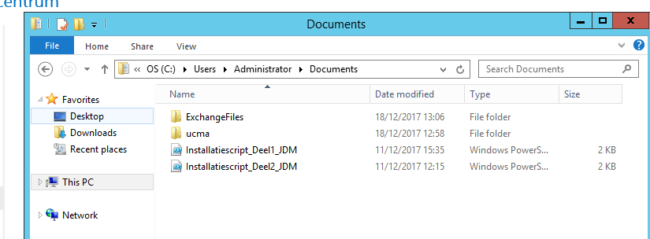
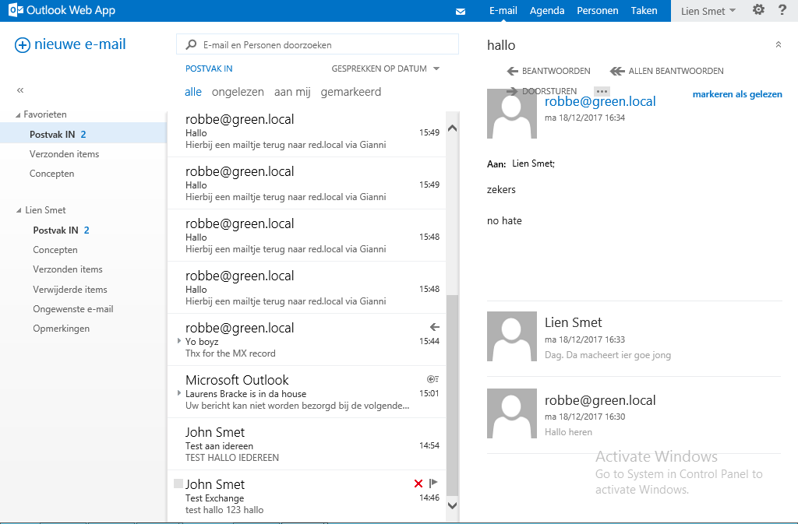
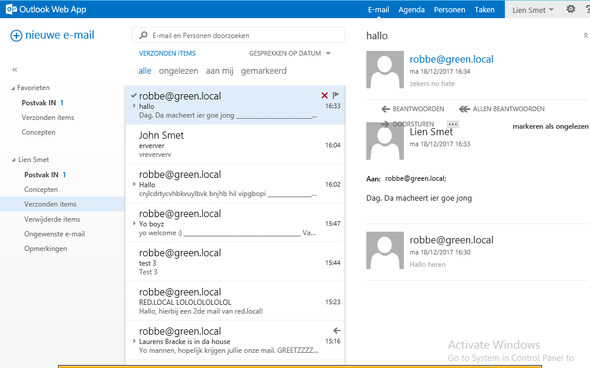
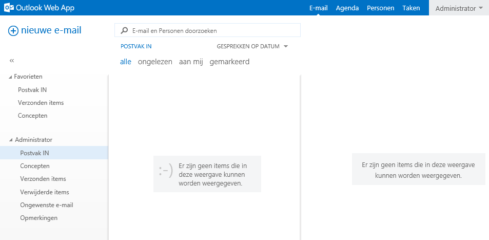
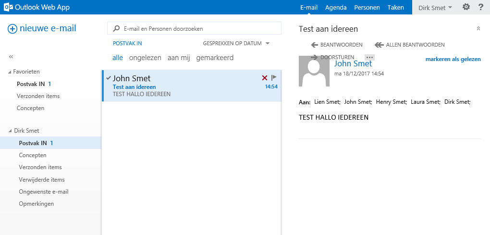
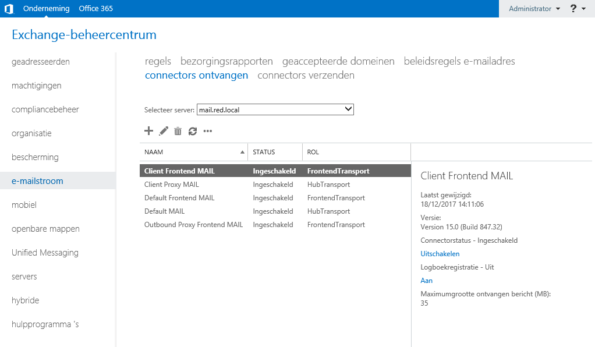

# Verzameling van alle Testrapporten

# Alfa2

## Installatie Windows Server 2016
1. Log in op Alfa 2:
	- **Account name:** _red/administrator_
	- **Paswoord:** Aa12345
2. Open *Command Prompt*;
3. Type `winver` en druk op *enter*;
4. Controller of het *Operating system version* op `Windows Server 2016 Standard` staat.

## Netwerkinstellingen
1. Log in op Alfa 2:
	- **Account name:** _red/administrator_
	- **Paswoord:** Aa12345
2. Open *Command Prompt*;
3. Type `ipconfig` en druk op enter.
4. Het IP-adres moet als volgt geconfigureerd zijn: 
	- IP-address: 172.18.2.67
	- Netmask: 255.255.0.0
	- Default Gateway: 172.18.2.65
	- DNS: 172.18.2.67 OF 127.0.0.1

## Server naam en domein naam
1. Log in op Alfa 2:
	- **Account name:** _red/administrator_
	- **Paswoord:** Aa12345
2. Open *Command Prompt*;
3. Type `HOSTNAME` en druk op *enter*;
4. Indien er **ns1** verschijnt, is de naam goed geconfigureerd.
5. Type `wmic computersystem get domain` en druk op *enter*;
6. Indien er **red.local** verschijnt, is dat ook goed geconfigureerd.

.jpg)

## AD DC & DNS
1. Start de server `Alfa2`
2. Log in met de gebruiker;
	- **Account name:** _red/administrator_
	- **Paswoord:** Aa12345
3. Open *Server Manager*.
4. Indien er aan de linkerkant `AD DS` en `DNS` staat, zijn de rollen succesvol geïnstalleerd.

.jpg)

## DNS forwards
1. Start de server `Alfa2`
2. Log in met de gebruiker;
	- **Account name:** _red/administrator_
	- **Paswoord:** Aa12345
3. Open *Server Manager*;
4. Klik op **Tools**;
5. Klik op **DNS**;
6. Klik op **Forwarders**;
7. Er zijn twee forwarders:
	- 193.190.173.2
	- 193.190.173.1

.jpg)

## OU & Users
1. Log in op Alfa 2:
	- **Account name:** _red/administrator_
	- **Paswoord:** Aa12345
3. Open *Command Prompt*;
4. Type `dsa.msc` in en klik op enter.
6. Klap red.local uit.
7. In de subfolders van *red.local*, Open RED.
8. Daarin moet je de volgende mappen terug kunnen vinden:
 - Administratie
 - Directie
 - IT Administratie
 - Ontwikkeling
 - Verkoop
 - Werkstation
 
 .jpg)
 
 
 
 .jpg)
 
9. In elk van de bovenstaande mappen (behalve in de map Werkstation" moet je een groep met dezelfde naam en met minstens één gebruiker terug kunnen vinden.
10. Indien dat het geval is, zijn de groepen goed aangemaakt.
11. In de map "Werkstation" moet je vijf werkstations terug kunnen vinden met de volgende namen:
 - AClient
 - DClient
 - ITClient
 - OClient
 - VClient
 **Werkstations waren nog niet klaar tegen het einden**
 
12. Als laatst controleren we of de gebruikers tot de juiste groep(en) behoren. Dit doen we als volgt:
 - Bezoek één per één iedere map in **stap 7**; 
 - Right-mouse click op de group die in de map zit. **Klik op eigenschappen**;
 - **Klik** daarna op de tab "Members";
 - Indien je daar de gebruikers als volgt kan terug vinden, is alles goed geconfigureerd:

## Gebruikers
1. Log in op een Workstation:
	- **Account name:** _red/administrator_
	- **Paswoord:** Aa12345

## Policies
1. Start de server `Alfa2`
2. Log in met de gebruiker;
	- **Account name:** _red/administrator_
	- **Paswoord:** Aa12345
3. Open *Server Manager*;
4. Klik op **Tools**;
5. Klik op **Group Policy Management**;
6. Klap **Forest: red.local**, **Domains**, **red.local**, **Group Policy Objects** uit;
7. Er staan 5 policies:
	 - ActiveScripting;
	 - ControlPanelGameLink;
	 - FileServer;
	 - Netwerkadapter;
	 - SQLpoortenVoorSSCM2012R2;
   
   

## Fileserver (Kan pas getest worden als Lima 2 af is)
1. **Log in op een werkstation met de volgende gebruikers**. Bij elk gebruiker moeten enkel de volgende shares te zien zijn als je *File Explorer* opent. Voer in elk folder de acties onder *Testing* uit:

| Gebruikersnaam en wachtwoord| Zichtbare Shares|Permissions|Testing |
|-----------|---------------------|---------------------|---------------------|
| John.Smet@red.local - P@ssword|ITData|Full Control|Voeg een bestand toe, wijzig en sla op, en verwijder|
| | VerkoopData|Full Control|Voeg een bestand toe, wijzig en sla op, en verwijder|
| | OntwikkelingData|Full Control|Voeg een bestand toe, wijzig en sla op, en verwijder|
| | DirData|Full Control|Voeg een bestand toe, wijzig en sla op, en verwijder|
| | AdminData|Full Control|Voeg een bestand toe, wijzig en sla op, en verwijder|
| | ShareVerkoop|Full Control|Voeg een bestand toe, wijzig en sla op, en verwijder|
| | HomeDirs|Full Control|Voeg een bestand toe, wijzig en sla op, en verwijder|
| | ProfileDirs|Full Control|Heeft een folder met jouw naam|
| Lien.Smet@red.local - P@ssword |AdminData|Read, Write|Voeg een bestand toe, wijzig en sla op, en verwijder|
| | HomeDirs |Read, Write |Voeg een bestand toe, wijzig en sla op, en verwijder|
| | ProfileDirs|Full Control|Heeft een folder met jouw naam|
| Henry.Smet@red.local - P@ssword |DirData |Read, Write|Voeg een bestand toe, wijzig en sla op, en verwijder|
| | HomeDirs |Read, Write |Voeg een bestand toe, wijzig en sla op, en verwijder|
| | ProfileDirs|Full Control|Heeft een folder met jouw naam|
| Laura.Smet@red.local - P@ssword |OntwikkelingData|Read, Write|Voeg een bestand toe, wijzig en sla op, en verwijder|
||ShareVerkoop|Read|Lees een bestand dat al toegevoegd is in het map. Verwijderen en wijzigen zou niet mogen lukken.|
| | HomeDirs |Read, Write |Voeg een bestand toe, wijzig en sla op, en verwijder|
| | ProfileDirs|Full Control|Heeft een folder met jouw naam|
| Dirk.Smet@red.local - P@ssword|VerkoopData|Read, Write|Voeg een bestand toe, wijzig en sla op, en verwijder|
| |ShareVerkoop | Read, Write | Voeg een bestand toe, wijzig en sla op, en verwijder|
| | HomeDirs |Read, Write |Voeg een bestand toe, wijzig en sla op, en verwijder|
| | ProfileDirs|Full Control|Heeft een folder met jouw naam|

**Drik Smet:**
.jpg)

**Permissies van alle gebruikers zijn op de release getest, maar er zijn geen afbeeldingen van genomen.**

# Bravo2

# Charlie2

## Testrapport_Prerequ
**Alles werkt, behalve de eerste, want die is blijkbaar niet meer nodig.**

## Testrapport_Extractie
**De extractie is succesvol.**

## Testrapport_Mail_Sturen
**We ontvangen mails van zowel green.local alsook van red.local.**

**We kunnen mails naar zowel green.local alsook red.local sturen.**

## Testrapport_Configuratie
**We kunnen inloggen met administrator op OWA.**

**We kunnen inloggen met een gebruiker op OWA.**

**We kunnen inloggen met administrator op ECP.**

# Kilo2

## IP-configuratie
	
- Controleer IP configuratie van de DHCP server(Kilo2)

	` `
	IP-adres: 172.18.2.2
	Subnetmask: 255.255.255.224
	Default-Gateway: 172.18.2.1
	DNS: 172.18.2.67 en 172.18.2.68

## IP-configuratie bij nieuwe client

- Een nieuwe client moet een ip-adres binnen deez range toegekend worden

	IP-adres: 172.18.2.50 - 172.18.2.100
	Subnetmask: 255.255.255.224

- Ip config voor verbinding met DHCP server(Kilo2)

- Ip config na het verbinden met DHCP server(Kilo2)

)

- SUCCESVOL

# Lima2

1. Stappenplan voor het installatie van FileServer is goed geschreven. Zonder enige kennis kon ik het uitvoeren.

2. Er is ingelogd met alle users binnen het domein. Na het inloggen was de shares zichtbaar zoals het moest.

3. De quotoms zijn goed ingesteld. 

4. Shadowcopy werd manueel aangemaakt. 

# Oscar2

### Dependencies:

- HyperV geïnstalleerd

## Stap 1: Start de server op in Hyper-V
* Ik ben als Administrator succesvol ingelogd.
* Het controlpaneel van PRTG werd automatisch opgestart.

## Stap 2: Controle

* In het overzicht kun je alle servers terugvinden. Iedere server toont zijn CPU verbruik, zijn geheugen, de toestand van de harde schijf en zijn specifiek service: Sharepoint, Mail, IIS, MS-SQL

# Papa2

### Testrapport

* Verantwoordelijke uitvoering: team Papa2
* Verantwoordelijke testen: Arto Collumbien en Sandrien Amourette

**Testen van het tesplan die hier niet worden getest, waren optioneel in de uitvoering**

## Services, roles, en features

Open de Server manager en Tools nog eens om te controleren of de nodige roles, role services en features zijn geïnstalleerd.

**Gecheckt en in orde**

**Gecheckt en in orde**

**Gecheckt en in orde**

**Gecheckt en in orde**

**Gecheckt en in orde**

## Group Policy

Controleer ook of de Windows ADK geïnstalleerd is door op de Windows-toets te drukken en naar Apps te gaan. Scroll tot het einde en onder Windows Kits.

**Gecheckt en in orde**

Controleer vervolgens of er een installatie is uitgevoerd van MS SQL server 2014 door op de Windows-toets te duwen en SQL 2014 te typen. Open deze niet!

**Gecheckt en in orde**

Controlleer tenslotte of System Center 2012 R2 correct is geinstalleerd door het programma te openen.

**Gecheckt en in orde**

### Troubleshooting

Optie 66 en 67 ingesteld. Bij het proberen booten via PXe krijgen we een TFTP acces violation error. 

# Mike2

### Testrapport Final Release Mike2
## Stap 1: Installatie Windows Server 2016
  1. Server is correct ingesteld. Server zit in het domein red.local.
  2. We kunnen inloggen met domeinaccount RED\Administrator.
  3. Bij het gebruiken van het commando winver is te zien dat versie 'Windows Server 2016 Standaard' geïnstalleerd is.
## Stap 2: Netwerkinstellingen
  - IP-address: 172.18.2.4
  - Netmask: 255.255.255.224
  - Default Gateway: 172.18.2.1
  - DNS: 172.18.2.67 EN 172.18.2.68
  
  Deze instellingen zijn correct ingesteld en kan verbinding maken met het domein.
  
  
## Stap 3: Server naam en domein naam
  1. De server naam is Mike2 (correct)
  2. Server behoort tot het domein red.local (correct)
  
  
  
## Stap 4: Scripts
  1. Om te controleren of alles geinstalleerd is voeren we het script 'Roleconfig.ps1' uit. Hier zien we dat elke role 'NoChangeNeeded' terug 
  geeft. Dit wil zeggen dat alle nodige rollen geïnstalleerd zijn.
  2. Het mounten van de iso's in goed verlopen. Als je naar 'this PC' gaat zien de verschillende iso's staan.
  3. Voer prerequisitinstaller.exe uit. Elke feature geeft weer dat er geen actie ondernomen is, dus elke feature is correct geïnstalleerd.
  
  
## Stap 5: Sharepoint
  1. We voeren setup.exe uit van de WindowsSharePointServer2016EN.iso uit. We krijgen enkel de optie Repair en Remove te zien.
  Dus de installatie is goed verlopen.
  2. Om de server te controleren surfen we naar http://mike2:2017/. Dit lukt op de eigen server en op andere servers.
  De server is succesvol geïnstalleerd en geconfigureerd
  

# November2

### Testplan November2 final release

* Verantwoordelijke uitvoering: Maarten De Smedt

* Verantwoordelijke testen: Robin Cleyman

## Server opzetten + Aanmelden

Server werkt zonder problemen.

## Testen

### IP - Server Name - Domein

### IP

#### Computernaam en Domein

### Aanmaken Directories

### Java en .Net Installatie 

#### Java

#### .Net

### Firewall

### SQl Server

## Samenvatting

De server is volledig en correct geïnstalleerd.

# Delta2

### Testrapport Delta2 Final Release 

### Stap 1
Windows is normaal opgestart
### Stap 2
Script uitgevoerd zonder problemen.

### Stap 3
Get-WindowsFeature toont alle Features als 'Installed' dit is correct.
 
### Stap 4
	- Time zone is correct
	- Alle features zijn in orde.
	- IP instellingen zijn correct. Server is ook in het domein toegevoegd en de naam Delta2 is aan de server gegeven.
### Stap 5
Login met RED\Administrator is gelukt.
### Stap 6
Het bestand DotNetCore.2.0.3-windowsHosting.exe is goed uitgevoerd.
### Stap 7
 Server is geconnecteerd met Databank en heeft een databank gecreëerd.
### Stap 8
Eerst naar de tool Internet Information Services Manager gegaan. Vervolgens Default Web Site geopend.

Applicatie toegevoegd met de domainuser. Tests zijn geslaagd
Na de permissions en Directory Browsing aan te passen kan ik de applicatie zien online. Alles is dus correct geïnstalleerd en verlopen.

### Stap 9
IIS is correct gereset en er kan geschreven worden naar de databank.

---
# Netwerk
### Testrapport netwerk red

* Verantwoordelijke uitvoering: Robin Bauwens en Laurens Bracke

## Testen

# Fysieke opstelling komt overeen met die van de packet tracer

Opstelling Packet Tracer:

Fysieke opstelling week 13 (final release):

Deze komen overeen, we zien op de foto ook dat alle poorten open staan en werken.

# Configuratie is correct en komt overeen

We kijken naar de config van de routers/switch in de config files (map nieuwe config) en kijken of deze overeenkomen.

Router 1:

Router 2:

Router 3:

Router 4:

Switch:

Alle configuraties komen overeen met de config files en kloppen.

# Pingen tussen alle routers

We pingen van elke router naar een andere router om te kijken of de connecties kloppen.

Ping naar router 1:

Ping naar router 2:

Ping naar router 3:

Ping naar router 4:

We kunnen pingen naar elke router en hebben 0% packet loss, dus alle verbindingen werken.

# Pingtest tussen linux en windows:

We verbinden een PC aan het linux en windows gedeelte (deze verkrijgen beiden een internetconnectie) en testen of deze kunnen pingen naar elkaar.

Ping van linux naar windows:

Ping van windows naar linux:

Men verkrijgt internet en alle pings lukken. De opstelling is dus correct.

# Test webserver

Webserver linux (green-local):

Webserver windows (red-local):

We verkrijgen beide webservers (delta en echo) dus alles klopt.

