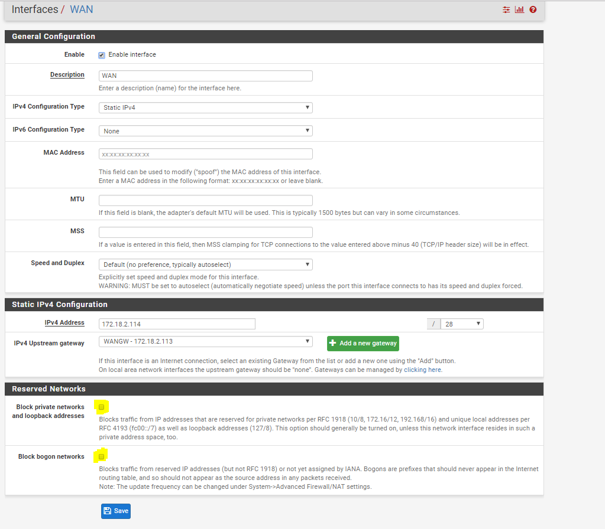
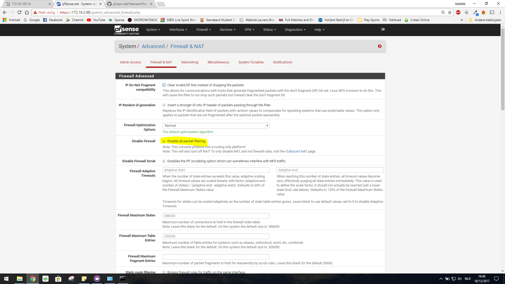
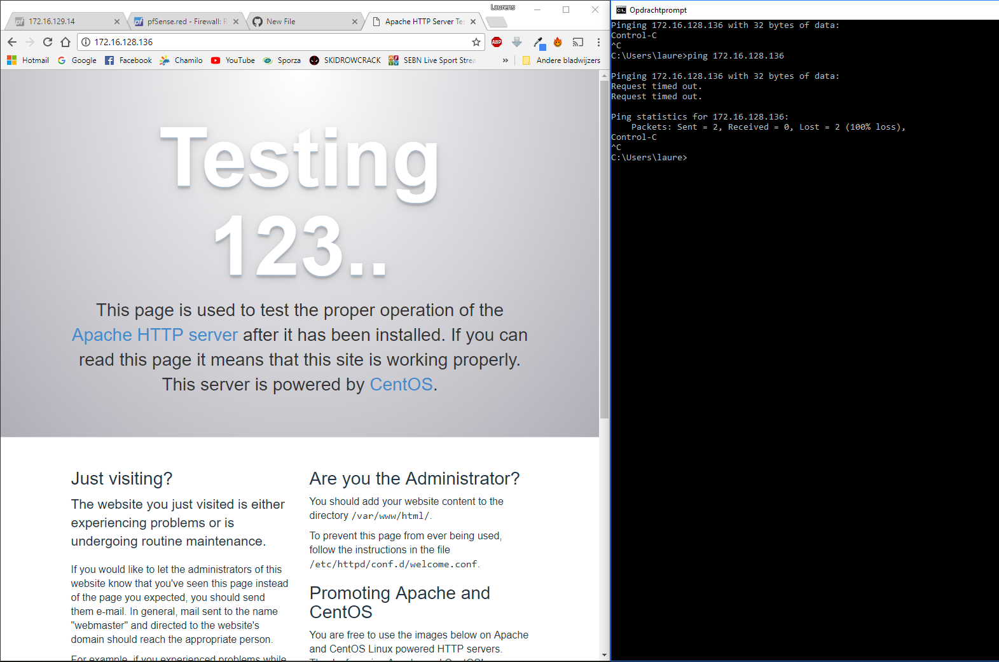

# Testrapport firewall

Verantwoordelijke testen: Pieter en Ebu

## Uitvoering testplan

### Configuratie

We kunnen de informatie over configuratie van de firewall uit de XML of PDF halen. Hierin zien we dat de protocollen van het LAN toegelaten worden, DNS-resolving uit staat, hostname en timezone geconfigureerd zjin, DNS-servers met domeinnaam en upstream WAN ook in orde is, en dat de interfaces ook correct zijn.

### Opstelling (connectiviteit) testen

We gebruiken de (netwerk)opstelling van de PT, uitgevoerd vanaf een client in VLAN 200. Deze heeft een IP-adres gekregen van de DHCP-server en heeft volledige (netwerk)connectiviteit met alle andere servers (incl. de Linux-kant).

We gebruiken de laatste versie van configuratie, deze werd geüpdatet met een nieuwe rules (voor WAN en LAN). We gebruiken dus **niet** de opstelling van het testplan, aangezien dit enkel geldig is voor een vereenvoudigd netwerk.

- [Rules LAN](w13/RULES_LAN.pdf)
- [Rules WAN](w13/RULES_WAN.pdf)
- [Routes](w13/routes.pdf)
- [Gateways](w13/routes2.pdf)
- We hebben ook "reserved networks" aangepast
    - 
- Packet filtering staat dus effectief aan
    - 

Alle configuratie komt dus overeen en we kunnen de webserver buiten ons domein (via/over de firewall) bereiken, pings mislukken aangezien we dit niet hebben toegelaten (ICMP).

De mails die verstuurd werden door de Linux-mailserver (en de mails die wij versturen naar de Linux-mailserver) komen ook aan op onze mailserver. [Zie testrapport Charlie2](https://github.com/HoGentTIN/p3ops-red/blob/master/TESTRAPPORTEN%20RELEASE/Testrapport_Charlie2.md)

- 
    - We stellen vast dat we vanaf een client (in het intern netwerk) de Linux-webserver kunnen bereiken (dus ook over/door de firewall heen)
