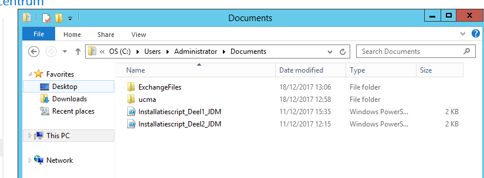
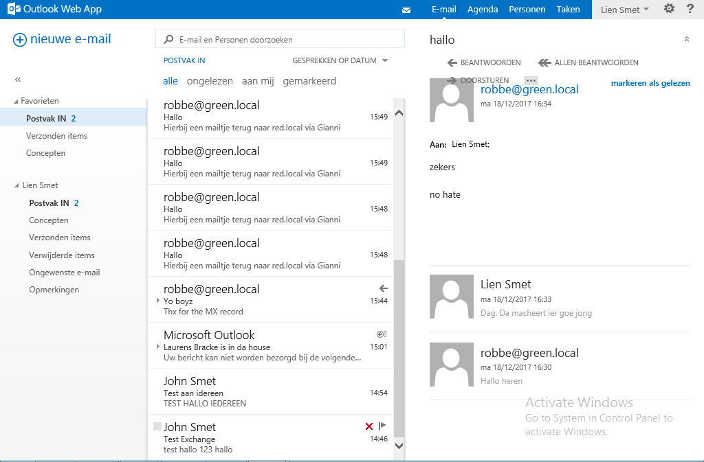
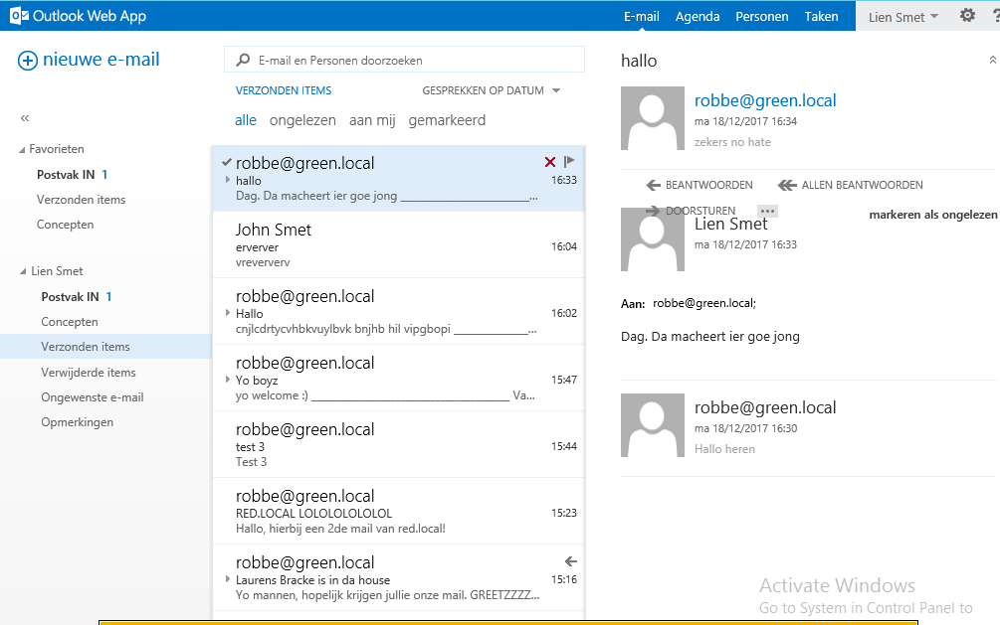
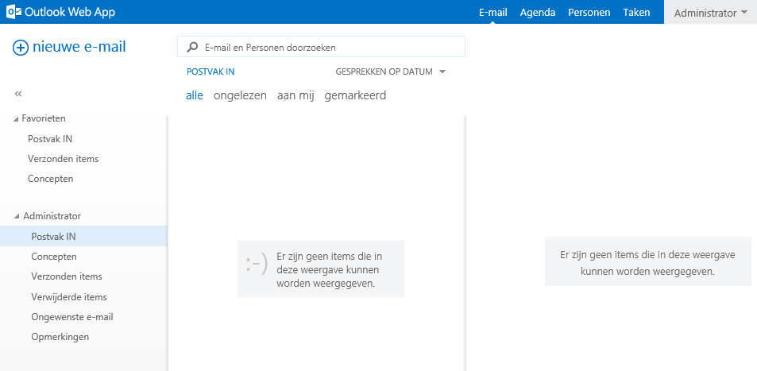

# Testplan Charlie2
* Verantwoordelijke uitvoering: team Alfa2 & Bravo 2
* Verantwoordelijke testen: Patrick Weyn

**Testen van het tesplan die hier niet worden getest, waren optioneel in de uitvoering**
## Testrapport_Prerequ
**Alles werkt, behalve de eerste, want die is blijkbaar niet meer nodig.**

## Testrapport_Extractie
**De extractie is succesvol.**

## Testrapport_Mail_Sturen
**We ontvangen mails van zowel green.local alsook van red.local.**

**We kunnen mails naar zowel green.local alsook red.local sturen.**

## Testrapport_Configuratie
**We kunnen inloggen met administrator op OWA.**

**We kunnen inloggen met een gebruiker op OWA.**

**We kunnen inloggen met administrator op ECP.**

