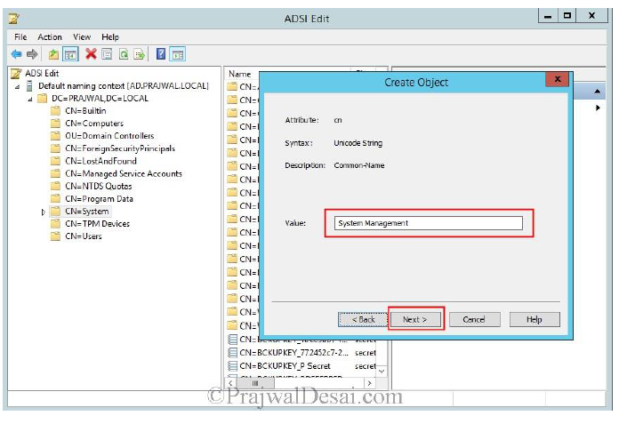
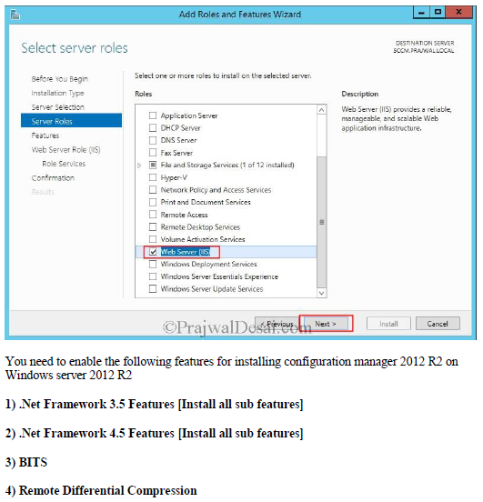
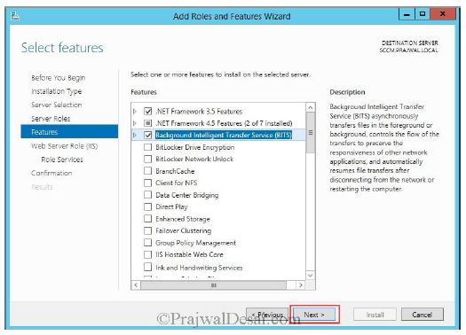
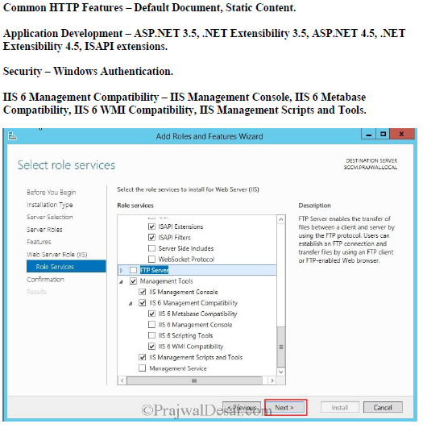
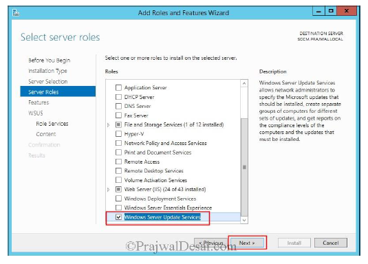
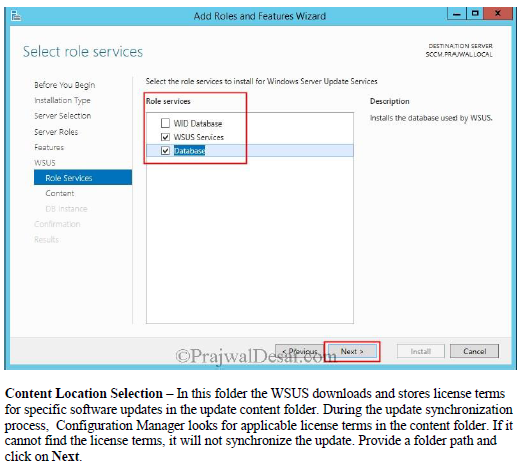
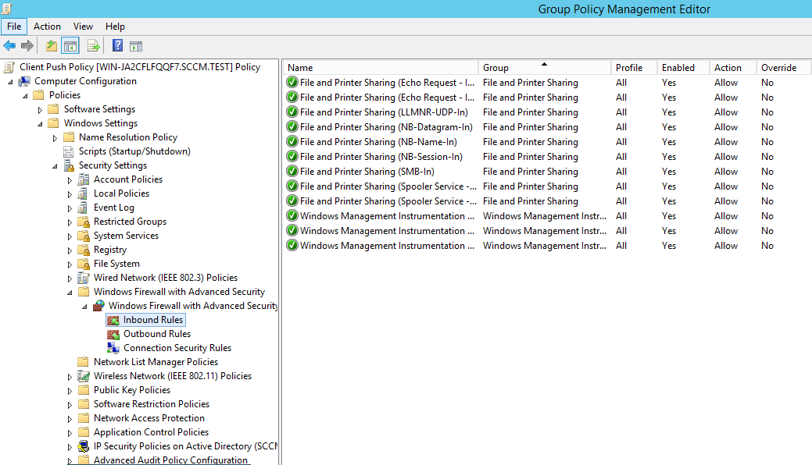
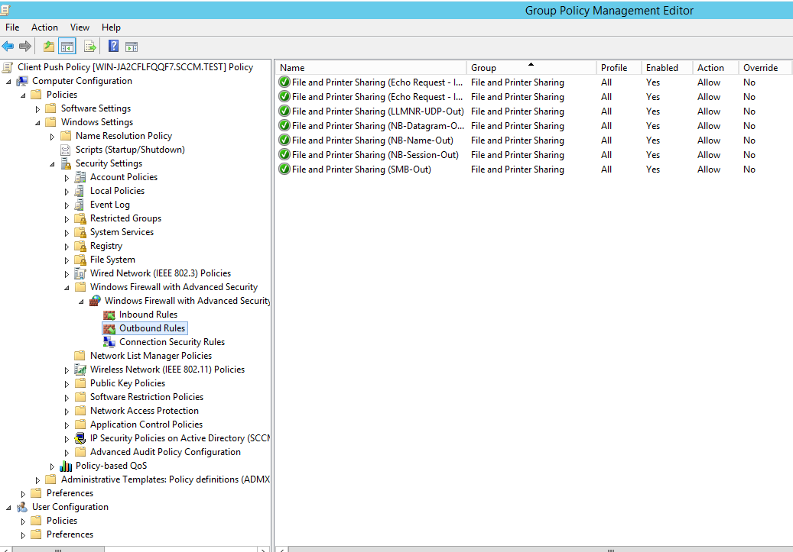
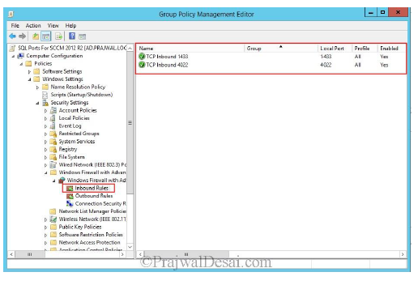

# Testplan

In deze iteratie gaan we een MSCS lokaal installeren en configureren om in een eerste poging om alles in orde te brengen. Zodanig dat we daarna alles kunnen automatiseren.

## Requirements

- Doel: Na het lezen van dit testplan moeten de testers instaat zijn om in 5 minuten te kunnen uitleggen hoe je de Papa2-server lokaal moet installeren
- Geschatte tijd: 02/09 tot 09/10

## Testplan

|Objectief|Korte beschrijving|Uitgevoerd|
|---------|------------------|-------|
|Documentatie|De uitleg met hoe we te werk zijn gegaan om MSCS lokaal te installeren.||
|Test rapport|Er is een rapport geschreven over het testplan||
|Resources|De nodige ondersteunende filmpjes en uitleg zoeken op YouTube en Google, om toch al eens (half) te zien hoe het moet.||

## Documentation

Ga als eerste naar de Active Directory die is geïnstalleerd en controleer of ADSI Edit een verbinding heeft met de Default naming context. Controleer ook in dit scherm of System Management is aangemaakt onder CN=System.

Ga vervolgens naar Active Directory Users and Computers (onder Server Manager, Tools) en controleer of de Advanced Features aanstaan (onder View). Controleer vervolgens of de primary site server computer account rechten heeft tot het System Management object onder System.

Open hierna Server manager en Tools nog eens om te controleren of de nodige roles, role services en features zijn geïnstalleerd.

Klik hierna nog eens op Tools onder Server Manager en open vervolgens Group Policy manage console. Kijk vervolgens bij de Inbound Rules en Outbond Rules of de uitzondering voor File and Printer Sharing services is toegevoegd.

Controleer vervolgens of er een installatie is uitgevoerd van MS SQL server 2012 (of jonger) door het programma te openen en of de poort voor SQL replication in orde is.

Controlleer tenslotte of System Center 2012 R2 correct is geinstalleerd door het programma te openen.

## Test report

Client Push Policy in-en outbound rules toevoegen.

## Resources

De nodige documentatie hebben we verzameld in [dit bestand](https://github.com/HoGentTIN/p3ops-red/blob/master/papa2%20-%20werkstations/Links.md) opgeslaan.
