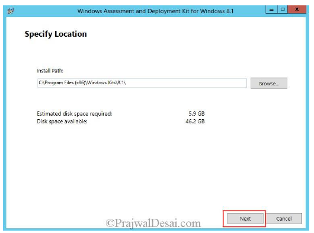

# Testplan

In deze iteratie gaan we een MSCS lokaal installeren en configureren om in een eerste poging om alles in orde te brengen. Zodanig dat we daarna alles kunnen automatiseren.

## Requirements

- Doel: Na het lezen van dit testplan moeten de testers instaat zijn om in 5 minuten te kunnen uitleggen hoe je de Papa2-server lokaal moet installeren
- Geschatte tijd: 02/09 tot 09/10

## Testplan

|Objectief|Korte beschrijving|Uitgevoerd|
|---------|------------------|-------|
|Documentatie|De uitleg met hoe we te werk zijn gegaan om MSCS lokaal te installeren.||
|Test rapport|Er is een rapport geschreven over het testplan||
|Resources|De nodige ondersteunende filmpjes en uitleg zoeken op YouTube en Google, om toch al eens (half) te zien hoe het moet.||

## Documentation

Als eerste start je een standaardinstallatie op voor een Windows Server 2012R2. Na de installatie moet je als eerste een AD/DC  installeren (DNS is op zich niet nodig). De root domain name is volledig vrij om te kiezen.

Hierna open je de Tool ADSI Edit.

Rechterklik op ADSI Edit en klik op connect to. Verander niets en klik op oké.

Open nu Default Naming Context volledig en rechterklik op CN=System en daarna op New -> Object

Duid in het venster Create Object nu container aan en klik op next.

Hierna vul je System Management in bij Value.

Nadat dit is aangemaakt moet je terug naar de tools gaan en op Active Directory Users and Computers klikken. Zorg eerst dat je op View klikt en enable advanced features. Toon nu de volledig system-boom, rechterklik op system management en daarna op delegate control.

Klik vervolgens op add, Object types en plaats een vink bij computers. Voer hierna de naam van de primaire site server computer account in en druk op ok.

Vervolgens moet je de Active Directory Schema extenden.
Dit doe je door de .exe extadh te vinden. Normaal zit deze onder \smssetup\bin\x64 in de installatie DVD of ISO die je hebt gebruikt. Dus, steek deze opnieuw in of re-mount het. Houdt de shift-toets ingedrukt en rechterklik op extadsh.exe en selecteer Copy As Path.

Open CMD en paste nu het pad erin en druk op enter.

Daarna moet je alle Roles & Features installeren. Informatie over alle rollen en features zie je hieronder. Als een installatie vraagt achter de installatie media, mount de ISO of steek de DVD erin en geef dan het pad ernaar.

Hierna moeten we de Windows ADK installeren. De recentste is Windows ADK for Windows 10, version 1703.
Download deze en voer de installatie uit zoals hieronder beschreven (customer experience doet er niet echt toe).

Vervolgens moet er nog een SQL server geinstalleerd worden. Mount de ISO hiervan of steek de DVD in en voer een standaard installatie uit zoals hieronder beschreven staat.

Klik op OK als de installatie gedaan is en accepteer in het volgende scherm de license terms en druk op next.

Als er warnings zijn is dit geen probleem. Druk gewoon op next wanneer de installatie gedaan is.

De aangeduide features moeten ZEKER geinstalleerd worden voor CM2012 R2, alle andere features zijn optioneel.

Duidt vervolgens Default instance aan.

Vul nu de Service Accounts gegevens in. Als Best Practise wordt er aangeraden om Domain Service Accounts te gebruiken en geen local user. Gebruik dus best Administrator + het wachtwoord dat je zelf gegeven hebt. Behalve bij SQL Server Browser.

Voeg de huidige gebruiker daarna toe aan de SQL server administrators en druk op next.

Als het geheugengebruik van MSSQL niet wordt gelimiteerd dan zal de server waarschuwing gooien. Zet daarom een limiet in op de MSSQL server. Het maximum is 8GB, het minimum is zelf te kiezen.

We zullen ook nog WSUS moeten configureren op de server. Voeg de rol toe zoals hieronder aangetoond wordt.

1ste aandachtspunt! We hebben geen WID database nodig. Ontvink deze.

2de aandachtspunt! Voer de WSUS configuratiewizard na de installatie NIET uit. Dit kan conflicten veroorzaken met WSUS for Configuration Manager 2012 R2 later.

Configureer vervolgens de Firewall met deze settings. Open al eerste Server Manager vanuit de Tools en open Group Policy en volg daarna de stappen.

Open daarna deze poorten nog. Hiervoor moet je Group Policy Management openen en een nieuwe policy maken door deze een naam te geven en de rest van de stappen te volgen.

Installeer tenslotte System Center 2012 R2 en ook deze hotfixes door deze stappen te volgen en de lijst met hotfixes te downloaden en installeren.

- Installing Hotfix (KB2905002)
- Installing Hotfix (KB2907591)

Na de installatie van SC2012R2 moeten deze configuraties nog gebeuren.
Als eerste gaan we discovery en bounderies configureren via deze stappen:

Hierna moeten de Site System Roles nog geconfigureerd worden.

Als laatste moet je gewoon nog de client settings configureren.

## Test report

    To do door ...

## Resources

De nodige documentatie hebben we verzameld in [dit bestand](https://github.com/HoGentTIN/p3ops-red/blob/master/papa2%20-%20werkstations/Links.md) opgeslaan.
