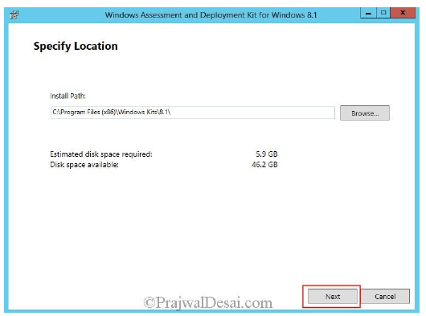

# Testplan

In deze iteratie gaan we een MSCS lokaal installeren en configureren om in een eerste poging om alles in orde te brengen. Zodanig dat we daarna alles kunnen automatiseren.

## Requirements

- Doel: Na het lezen van dit testplan moeten de testers instaat zijn om in 5 minuten te kunnen uitleggen hoe je de Papa2-server lokaal moet installeren
- Geschatte tijd: 02/09 tot 09/10

## Testplan

|Objectief|Korte beschrijving|Uitgevoerd|
|---------|------------------|-------|
|Documentatie|De uitleg met hoe we te werk zijn gegaan om MSCS lokaal te installeren.||
|Test rapport|Er is een rapport geschreven over het testplan||
|Resources|De nodige ondersteunende filmpjes en uitleg zoeken op YouTube en Google, om toch al eens (half) te zien hoe het moet.||

## Documentation

Als eerste start je een standaardinstallatie op voor een Windows Server 2012R2. Na de installatie moet je als eerste een AD/DC installeren. De root domain name is volledig vrij om te kiezen.

Hierna open je de Tool ADSI Edit en maak je de volgende aanpassingen.

Vervolgens moet je de Active Directory Schema extenden.

Daarna moet je alle Roles & Features installeren.

Installeer nu Windows ADK.

Hierna hebben we nog een SQL server nodig.

We zullen ook nog WSUS moeten configureren op de server.

Configureer vervolgens de Firewall met deze settings.

Open deze poorten.

Installeer tenslotte System Center 2012 R2 en ook deze hotfixes.

- Installing Hotfix (KB2905002)
- Installing Hotfix (KB2907591)

Na de installatie van SC2012R2 moeten deze configuraties nog gebeuren.

p.179

## Test report

    To do door ...

## Resources

De nodige documentatie hebben we verzameld in [dit bestand](https://github.com/HoGentTIN/p3ops-red/blob/master/papa2%20-%20werkstations/Links.md) opgeslaan.
